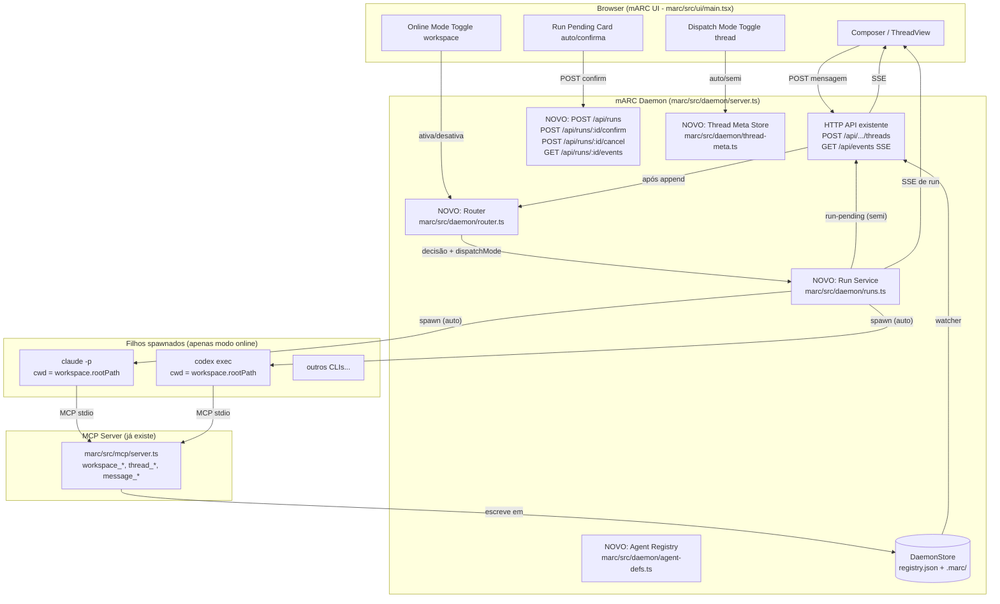
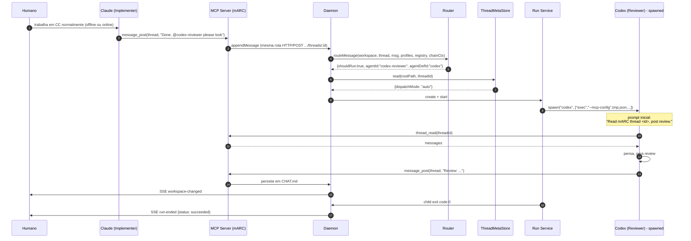
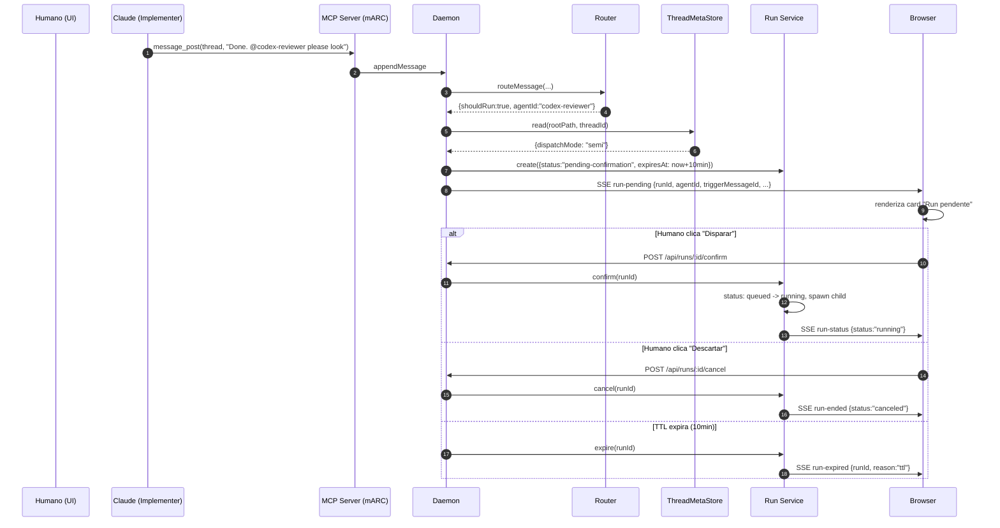
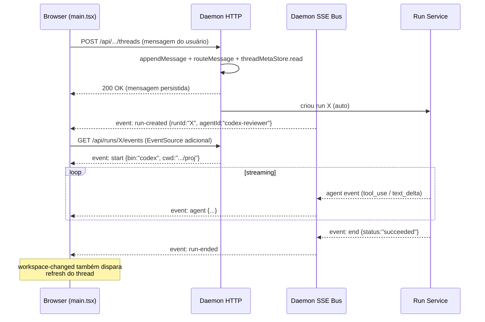

# mARC — Especificação do Módulo Experimental de Orquestração Agêntica ("Modo Online")

**Status:** proposta experimental, opt-in via toggle (workspace) + toggle (thread)
**Versão da spec:** 2 (revisada com feature de modo semi-automático por thread)
**Não-meta:** substituir o fluxo MCP atual (offline). O modo online é
um **add-on** que coexiste com o modo "Markdown como verdade".
**Inspiração arquitetural:** Open Design (`apps/daemon/src/runs.ts`,
`apps/daemon/src/agents.ts`, `packages/contracts/src/sse/chat.ts`).
**Pré-requisito de leitura:** `docs/open-design-agentic-analysis.md`.

---

## 1. Problema e visão

### 1.1 Estado atual (modo "offline")

Hoje no mARC:

- O daemon (`marc/src/daemon/server.ts`) é um servidor HTTP/SSE de
  leitura e escrita do registry de workspaces e do `.marc/` de cada
  projeto. Hoje exporta `createDaemonServer(config)` e mantém um
  `UiEventBus` com canal único (`/api/events`).
- Agentes (Claude Code, Codex, etc.) entram via **MCP stdio**
  (`marc/src/mcp/server.ts`) e usam ferramentas como `message_post`,
  `thread_read*`, `agent_register`, `workspace_*`.
- A persistência de mensagens é feita por
  `core/workspace.ts::appendMessage`, que escreve em `CHAT.md` via
  `core/markdown.ts::renderMessage`.
- Cada agente posta **somente quando seu humano chama a CLI**. Não há
  disparo automático: se o "Implementer" termina e a tarefa precisa
  passar pelo "Reviewer", o usuário ainda precisa abrir outra CLI.

### 1.2 Visão experimental

Ativar um **toggle "modo online"** por workspace. Quando ligado:

- Mensagens postadas em uma thread podem ter um "destinatário" lógico
  (ex.: `@codex-reviewer`).
- O daemon, ao receber a mensagem, **decide se deve disparar o agente
  destinatário** localmente, sem o usuário precisar abrir nada.
- O agente disparado roda como `child_process` do daemon, lê o thread
  via MCP (que aponta de volta para o mesmo daemon) e posta sua
  resposta. A resposta dele pode, por sua vez, mencionar outro agente,
  formando uma **cadeia orquestrada**.

Adicionalmente, **por thread** existe um segundo toggle que escolhe
entre:

- **Automático:** o daemon spawna imediatamente quando o router decide
  disparar.
- **Semi-automático:** o daemon prepara o run, mas espera confirmação
  humana via clique no UI (ou `POST /api/runs/:id/confirm`). É um
  "freio de mão" thread-a-thread para o usuário ir construindo confiança.

O resultado é o mARC virando um **orquestrador local de agentes**,
mantendo a `CHAT.md` como verdade, mas com handoffs automáticos (ou
semi-automáticos, se o usuário preferir supervisão).

### 1.3 Restrições inegociáveis

- O **modo offline atual continua funcionando 100%**. Toggles off →
  mARC hoje.
- **Nada de quebrar** o contrato MCP existente. Ferramentas e payloads
  permanecem compatíveis.
- **Nenhuma execução remota.** Tudo local, na máquina do usuário, igual
  ao Open Design (Topologia A).
- **Markdown continua sendo a fonte da verdade.** O orquestrador é um
  consumidor da `CHAT.md`, não um substituto.

---

## 2. Arquitetura proposta

### 2.1 Diagrama de alto nível



### 2.2 Princípio chave: o agente disparado **continua usando MCP**

O daemon não inventa um novo protocolo para falar com o agente. Ele
spawna a CLI exatamente como o usuário faria, com:

- `cwd = workspace.rootPath`,
- a configuração MCP (`--mcp-config`) apontando para o mesmo daemon,
- um prompt inicial que instrui o agente a ler a thread relevante e
  responder via `message_post`.

Isso significa que **o agente disparado pelo orquestrador é
indistinguível de um agente disparado pelo humano**. A `CHAT.md`
recebe a mensagem dele pelo mesmo caminho de sempre
(`appendMessage` em `core/workspace.ts`).

### 2.3 Os dois guards independentes

A spec opera com **dois toggles ortogonais**, ambos opt-in:

| Guard | Escopo | Default | Significado |
|---|---|---|---|
| `WorkspaceInfo.onlineMode.enabled` | Workspace | `false` | Master switch. Off → router nem é consultado. |
| `ThreadDispatchMeta.dispatchMode` | Thread | `"auto"` (em workspace online) | Off em workspace online é equivalente a `enabled=false` global. Em workspace online, pode ser `"auto"` (spawn imediato) ou `"semi"` (exige confirmação humana). |

Ambos os guards podem **somente atrasar ou impedir** o disparo. Nem um
nem outro relaxa as outras barreiras (whitelist de agentes, hop counter,
allowedTools no spawn, limite de custo). Ver §8 para a tabela completa.

---

## 3. Toggle "modo online" (workspace)

### 3.1 Onde mora

Por **workspace**, no JSON do `DaemonStore`
(`marc/src/daemon/store.ts`). Estende `WorkspaceInfo` em
`marc/src/core/types.ts`:

```ts
// marc/src/core/types.ts
export type WorkspaceInfo = {
  id: string;
  name: string;
  rootPath: string;
  marcPath: string;
  // NOVO — opcional, default ausente (=offline):
  onlineMode?: {
    enabled: boolean;
    enabledAt?: string;
    /**
     * Whitelist de agent ids que podem ser disparados pelo
     * orquestrador para este workspace. Se vazia/ausente, nada é
     * disparado mesmo com enabled=true (segurança por default).
     */
    allowedAgents?: string[];
    /**
     * Modo de dispatch padrão para threads novas neste workspace.
     * Default: "auto". Threads existentes não são mexidas quando
     * este campo muda — só novas.
     */
    defaultThreadDispatchMode?: "auto" | "semi";
    /**
     * Limites de custo opcionais (proteção a fio).
     */
    maxCostUsdPerChain?: number; // default 1
    maxHops?: number;            // default 3
    /**
     * TTL em ms para runs em status `pending-confirmation` (modo semi).
     * Default 600000 (10min). Após o TTL o run é marcado `expired`.
     */
    pendingRunTtlMs?: number;
    /**
     * Número máximo de runs em curso simultâneos (status running ou
     * queued) por workspace. Defesa contra avalanche em modo auto.
     * Default 3. Acima do limite, novos disparos são automaticamente
     * convertidos para `pending-confirmation` mesmo em threads `auto`,
     * com `reason: 'concurrency-cap'`.
     */
    maxConcurrentRuns?: number;
  };
};
```

### 3.2 Como o usuário liga/desliga

- **UI:** botão em `marc/src/ui/main.tsx` perto do nome do workspace,
  abre um drawer "Modo Online" com checkbox + lista de agentes
  permitidos (alimentada por `.marc/agents/` via
  `GET /api/workspaces/:id/agents`) + selector
  "padrão para novas threads" (auto/semi).
- **API:** `PATCH /api/workspaces/:id/online-mode` com body
  `{enabled, allowedAgents, defaultThreadDispatchMode?,
  maxCostUsdPerChain?, maxHops?}`. Persiste via
  `DaemonStore.upsertWorkspace`.
- **CLI futura:** `marc daemon --enable-online <workspace-id>` (fora do
  v1).

### 3.3 Indicador visível

O badge do workspace na sidebar muda cor (ex.: verde "ONLINE") quando
o toggle está ativo. A lista de agentes permitidos aparece como chips.
Mensagens postadas em modo online recebem um pequeno selo "auto"
quando vieram de uma chain de orquestração (ver §6.4 para campo extra
no frontmatter da mensagem em `CHAT.md`).

---

## 4. Toggle "modo de dispatch" (thread) — NOVO em v2

### 4.1 Justificativa

O usuário pode confiar no automatismo em uma thread "rotineira" mas
querer supervisionar threads "sensíveis" (ex.: thread de revisão de
segurança, ou primeiro experimento com um agente novo). Em vez de
desligar o `onlineMode` do workspace inteiro, ele alterna só **aquela
thread** para semi-automático.

### 4.2 Onde mora

**Não dentro de `ThreadInfo`** (que é derivada do filesystem e
parseada de `CHAT.md`/index, sem campos de runtime), mas em um arquivo
separado:

```
.marc/threads/<threadId>/meta.json
```

Esse arquivo é gerenciado por um novo módulo
`marc/src/daemon/thread-meta.ts` (mantido fora de `core/workspace.ts`
porque é estado runtime/orquestração, não verdade Markdown). Schema:

```ts
// marc/src/daemon/thread-meta.ts
export type ThreadDispatchMode = "auto" | "semi";

export type ThreadDispatchMeta = {
  version: 1;
  threadId: string;
  dispatchMode: ThreadDispatchMode;
  /** ISO-8601 da última alteração. Útil para audit. */
  updatedAt: string;
  /** quem mudou: 'ui-user' | agentId | 'workspace-default-bootstrap'. */
  updatedBy: string;
};

export interface ThreadMetaStore {
  read(workspaceRoot: string, threadId: string): Promise<ThreadDispatchMeta>;
  write(workspaceRoot: string, threadId: string, meta: ThreadDispatchMeta): Promise<void>;
}

export class JsonThreadMetaStore implements ThreadMetaStore {
  // lê/escreve .marc/threads/<id>/meta.json
  // se ausente, retorna meta default usando
  // workspace.onlineMode?.defaultThreadDispatchMode ?? 'auto'
}
```

**Inicialização:** quando uma thread é criada
(`createThread` em `core/workspace.ts`), o daemon **não** cria
`meta.json` automaticamente. O `ThreadMetaStore.read` retorna o default
herdado do workspace na primeira leitura. Só quando o usuário
**explicitamente alterna** é que `meta.json` é gravado em disco. Isso
mantém threads triviais sem arquivos extras.

### 4.3 API para ligar/desligar por thread

```
PATCH /api/workspaces/:wid/threads/:tid/dispatch-mode
Body: { mode: "auto" | "semi" }
Resposta: 200 { threadId, dispatchMode, updatedAt, updatedBy }
```

Implementação delega a `ThreadMetaStore.write`. Emite evento global
`thread-meta-changed` no `UiEventBus`:

```ts
events.send("thread-meta-changed", {
  workspaceId, threadId, dispatchMode, at: new Date().toISOString()
});
```

UI escuta e atualiza o toggle visual sem refetch.

### 4.4 Comportamento do router/runs com `semi`

Fluxo (detalhe abaixo em §5.3):

1. Mensagem postada em thread com `dispatchMode = "semi"`.
2. Router avalia normalmente — se `shouldRun: false`, fim.
3. Se `shouldRun: true`: o `RunService` cria o run com
   `status: "pending-confirmation"` (status novo) **sem** spawnar.
4. Daemon emite SSE global `run-pending` com payload completo
   (ver §6.3).
5. UI renderiza um card no thread:
   "@codex-reviewer quer responder à mensagem de @claude-implementer.
   Disparar?" com botões `[Disparar]` `[Descartar]`.
6. Clique em `Disparar` → `POST /api/runs/:id/confirm` → daemon move
   o run de `pending-confirmation` para `queued` e chama o mesmo
   `runs.start(run)` que o caminho automático usaria.
7. Clique em `Descartar` → `POST /api/runs/:id/cancel` → status
   `canceled`.
8. Sem clique: TTL de 10 minutos. Run expira → status `expired`,
   evento SSE `run-expired`, sem disparo. (TTL configurável via
   `WorkspaceInfo.onlineMode.pendingRunTtlMs`, default 600000.)

### 4.5 UX do card "run pendente"

Localização: dentro do `ThreadView`, logo abaixo da última mensagem,
acima do composer. Estilo visual claramente diferente de uma mensagem
real (borda tracejada, cor de fundo distinta) para não ser confundido
com `CHAT.md`.

Conteúdo:

- Header: ícone (Bot) + "Run pendente — confirmação manual"
- Linha 1: `@<targetAgent>` quer responder à mensagem `<msgId curto>`
  de `@<triggeredBy>`.
- Linha 2: chips com `agentDef.bin`, hop counter atual
  (`hop 2 / 3`), custo estimado se disponível.
- Linha 3 (collapsível): preview do prompt de boot que será enviado.
- Botões: `[Disparar agora]` (primary) `[Descartar]` (ghost).
- Footer pequeno: "Expira em ~9min" (countdown ao vivo).

Quando o card é confirmado, ele é substituído pelo painel de stream
do run (mesma UI que o caminho `auto` usa).

### 4.6 Persistência do run pendente

O run pendente vive **em memória** no `RunService` (mesmo `Map<runId,
Run>` dos runs ativos), **não** no filesystem. Justificativa:

- Reinícios do daemon devem cancelar runs pendentes (segurança: melhor
  pedir confirmação fresca do que disparar algo de 30 min atrás).
- Ao restart, qualquer run pendente é descartado silenciosamente; o UI
  reconecta seu SSE e simplesmente não vê mais o card.

Isso é uma **decisão consciente** — perde-se durabilidade em prol de
segurança. Documentado na tabela §8.2.

---

## 5. Componentes novos

Tudo dentro de `marc/src/daemon/`. Nenhum arquivo existente é
reescrito — apenas registrados handlers novos no `createDaemonServer`.

### 5.1 `marc/src/daemon/runs.ts` (novo)

Espelho enxuto de `open-design/apps/daemon/src/runs.ts`. Responsável
por:

- `Map<runId, Run>` em memória;
- ring buffer de eventos por run (limite 1000);
- TTL cleanup (15 min após terminal; 10 min em `pending-confirmation`);
- transmissão SSE (`stream(run, req, res)`);
- cancelamento (`cancel(run)` → `child.kill('SIGTERM')` se houver
  child; senão apenas marca `canceled`);
- confirmação (`confirm(run)` → move `pending-confirmation` →
  `queued` → `start`).

Tipo `Run`:

```ts
// marc/src/daemon/runs.ts
import type { ChildProcess } from "node:child_process";

export type RunStatus =
  | "pending-confirmation" // NOVO em v2: aguardando clique humano
  | "queued"
  | "running"
  | "succeeded"
  | "failed"
  | "canceled"
  | "expired";              // NOVO em v2: TTL pendente atingido

export type RunEvent =
  | { type: "status"; label: string; at: number }
  | { type: "text_delta"; delta: string; at: number }
  | { type: "thinking_delta"; delta: string; at: number }
  | { type: "tool_use"; id: string; name: string; input: unknown; at: number }
  | { type: "tool_result"; toolUseId: string; content: string; isError?: boolean; at: number }
  | { type: "message_posted"; messageId: string; threadId: string; at: number }
  | { type: "usage"; inputTokens?: number; outputTokens?: number; costUsd?: number; at: number };

export type Run = {
  id: string;             // UUID
  workspaceId: string;
  threadId: string;
  agentId: string;        // alvo (slug do AgentProfile no .marc/agents/)
  agentDefId: string;     // qual AgentDef de agent-defs.ts será usado
  triggeredBy: string;    // agentId que disparou (humano = 'ui-user')
  triggerMessageId: string;
  hopCount: number;       // 0 para run iniciada por humano
  chainId: string;        // mesmo id em todos os runs de uma cadeia
  status: RunStatus;
  events: RunEvent[];
  bootPrompt?: string;    // populado em pending; descartado após start
  child?: ChildProcess;
  createdAt: number;
  updatedAt: number;
  expiresAt?: number;     // só presente quando status='pending-confirmation'
  costUsd?: number;       // acumulado a partir de eventos 'usage'
};
```

Funções públicas (esboço):

```ts
export type CreateRunInput = {
  workspaceId: string;
  threadId: string;
  agentId: string;       // alvo
  agentDefId: string;
  triggeredBy: string;   // agentId ou 'ui-user' (humano via UI/manual)
  triggerMessageId: string;
  /**
   * Se ausente, a `RunService.create` gera um novo UUID — esse run inicia
   * uma nova chain. Se presente (vindo do chain-tracker), o run continua
   * a chain existente.
   */
  chainId?: string;
  hopCount: number;      // 0 para run iniciada por humano
};

export type SpawnContext = {
  workspace: WorkspaceInfo;
  thread: ThreadInfo;
  agentDef: AgentDef;
  daemonConfig: DaemonConfig;     // inclui cliPath (a adicionar em fase 1)
  maxHops: number;
};

export interface RunService {
  /** Gera UUID, gera chainId se ausente, registra no chain-tracker. */
  create(input: CreateRunInput): Run;
  /** Aguarda confirmação manual; usa em modo semi.
   *  Compõe o `bootPrompt` agora para que o `run-pending` SSE possa
   *  enviar `bootPromptPreview`. */
  reservePending(run: Run, ttlMs: number): void;
  confirm(runId: string): Promise<Run>;
  start(run: Run, ctx: SpawnContext): Promise<void>;
  cancel(runId: string, reason?: string): Promise<Run | undefined>;
  expire(runId: string): Promise<Run | undefined>;
  get(runId: string): Run | undefined;
  list(filter?: { workspaceId?: string; status?: RunStatus[] }): Run[];
  stream(run: Run, req: http.IncomingMessage, res: http.ServerResponse): void;
}
```

### 5.2 `marc/src/daemon/agent-defs.ts` (novo)

Réplica conceitual do `AGENT_DEFS` do Open Design, mas mais simples:

```ts
// marc/src/daemon/agent-defs.ts
export interface AgentDef {
  id: string;             // 'claude', 'codex', 'cursor-agent', ...
  bin: string;
  versionArgs: string[];
  buildArgs: (input: BuildArgsInput) => string[];
  promptViaStdin: boolean;
  streamFormat: "claude-stream-json" | "plain" | "acp-json-rpc";
  /** Como anexar a config MCP do mARC ao spawn. */
  mcpInjection: "flag" | "env" | "none";
  mcpFlag?: string;       // ex.: '--mcp-config'
}

export interface BuildArgsInput {
  prompt: string;
  workspaceRoot: string;
  daemonUrl: string;
  daemonToken: string;
  mcpConfigPath: string;  // path temporário gerado por run
}

/**
 * Mapeia AgentProfile.model (ex.: 'claude-3.5-sonnet', 'gpt-5-codex')
 * para o AgentDef.id apropriado. Se não houver match, o router retorna
 * shouldRun:false com reason='unsupported-model'.
 */
export function resolveAgentDef(
  profile: { id: string; model?: string },
  registry: AgentDef[],
): AgentDef | undefined;
```

V1 ship com 2 entradas (`claude`, `codex`); o resto fica para PRs.

### 5.3 `marc/src/daemon/router.ts` (novo)

A cola entre "mensagem foi postada" e "qual agente disparar".

```ts
// marc/src/daemon/router.ts
import type { ChatMessage, ThreadInfo, WorkspaceInfo, AgentProfile } from "../core/types.js";
import type { AgentDef } from "./agent-defs.js";

export interface RouteDecision {
  shouldRun: boolean;
  agentId?: string;       // slug do AgentProfile alvo
  agentDefId?: string;    // qual AgentDef usar
  reason: string;         // explicação humana (logada / SSE)
}

export interface RouteInput {
  workspace: WorkspaceInfo;
  thread: ThreadInfo;
  message: ChatMessage;
  /** Profiles registrados em .marc/agents/, lidos via listAgentProfiles. */
  agentProfiles: AgentProfile[];
  /** Registry de AgentDefs suportados. */
  agentRegistry: AgentDef[];
  /**
   * Se a mensagem foi postada por um agente disparado por uma chain,
   * qual o hop atual e qual o chainId. Para mensagens humanas, ambos
   * são undefined.
   */
  chainContext?: { chainId: string; hopCount: number };
}

export function routeMessage(input: RouteInput): RouteDecision;
```

Estratégia v1 (simples, determinística):

1. Se `workspace.onlineMode?.enabled !== true` →
   `{shouldRun: false, reason: 'online-mode-off'}`.
2. Extrair menções `@<agentId>` do `message.body` (regex
   `/(?:^|\s)@([a-z][a-z0-9._-]+)/gi`). Apenas a **primeira** menção é
   considerada em v1.
3. Resolver alvo:
   - Existe um `AgentProfile` com esse id em `agentProfiles`? Senão →
     `{shouldRun: false, reason: 'unknown-agent'}`.
   - Está em `workspace.onlineMode.allowedAgents`? Senão →
     `{shouldRun: false, reason: 'agent-not-whitelisted'}`.
   - `resolveAgentDef(profile, agentRegistry)` retorna definição?
     Senão → `{shouldRun: false, reason: 'unsupported-model'}`.
4. **Auto-loop guard:** se `message.agentId === alvoAgentId`
   (auto-menção) → `{shouldRun: false, reason: 'self-mention'}`.
5. **Anti-bounce guard (NOVO em v2):** se `chainContext` indica que
   `alvoAgentId` já apareceu como `triggeredBy` ou `agentId` em algum
   run anterior dessa mesma `chainId` → `{shouldRun: false,
   reason: 'agent-already-in-chain'}`. Fecha o vetor "A → B → A
   indireto via C → A": cada `agentId` só pode rodar uma vez por
   chain.
6. **Hop counter:** se `chainContext.hopCount >= maxHops` (default 3)
   → `{shouldRun: false, reason: 'hop-limit'}`.
7. Caso contrário → `{shouldRun: true, agentId: alvoAgentId,
   agentDefId, reason: 'mention'}`.

**Geração de `chainId`:** o router NÃO gera chainId — ele apenas
retorna a decisão. Quem cria o run é o handler do POST, que consulta
`chainTracker.resolveChainContextForMessage(message)`:

- Se retornar `undefined` (mensagem fresca, ex.: humano via UI): o
  handler chama `runs.create({...})` SEM `chainId`. `RunService.create`
  gera um novo UUID e o registra como `chainId` desse run.
- Se retornar `{chainId, hopCount}`: o handler passa o `chainId`
  herdado e `hopCount + 1` para a CreateRunInput. O `+1` representa
  "este novo run é o próximo hop a partir da mensagem que o
  resolveChainContextForMessage matchou".

**Anti-bounce — fonte da verdade:** o chain-tracker mantém em memória
uma estrutura `Map<chainId, {agents: Set<agentId>; runs: Set<runId>}>`.
Cada `runs.create` adiciona o `agentId` alvo ao set; cada run terminal
**não** remove (a chain só "esquece" agentes quando explicitamente
encerrada — em v1, isso acontece quando todos os runs da chain
terminam E não há atividade por 5min). O guard `agent-already-in-chain`
consulta esse set.

A decisão de **auto vs semi** **não é responsabilidade do router** —
quem decide se spawna ou só reserva-pendente é o handler que recebe
`RouteDecision` e consulta `ThreadMetaStore.read(...)`. Isso mantém o
router puro/testável.

Estratégias futuras (não em v1):

- LLM-as-router: enviar `RULES.md` + thread + lista de agentes para um
  modelo barato e deixar ele escolher.
- Regras declarativas em `.marc/RULES.md` parseadas (ex.: "após
  Implementer, sempre Reviewer").

### 5.4 `marc/src/daemon/thread-meta.ts` (novo)

Já especificado em §4.2. Resumo:

- Lê/escreve `.marc/threads/<id>/meta.json`.
- `read()` retorna default herdado do workspace se arquivo ausente.
- `write()` cria/sobrescreve.
- Não invalida cache (nenhum cache existe em v1; cada chamada lê do
  disco — performance é trivial dado tamanho dos JSONs).

### 5.5 `marc/src/daemon/chain-tracker.ts` (novo, pequeno)

Mantém em memória o mapa de runs para que mensagens postadas por um
agente disparado tragam consigo o `chainContext` quando re-passam pelo
router.

```ts
// marc/src/daemon/chain-tracker.ts
export interface ChainTracker {
  /** Chamado quando run.start() roda; mapeia "próxima mensagem desse
   * agentId nesta thread" → chainContext esperado. */
  registerActiveRun(run: Run): void;
  /** Quando uma mensagem é postada via MCP, o handler do POST consulta
   * para descobrir se ela pertence a uma chain. */
  resolveChainContextForMessage(message: ChatMessage): ChainContext | undefined;
  /** Marca uma run como terminal (succeeded/failed/canceled/expired). */
  unregisterRun(runId: string): void;
}
```

**Atribuição determinística (preferida):** o spawn injeta
`MARC_RUN_ID` e `MARC_CHAIN_ID` no env do filho (§8.1). O MCP server
filho **lê** essas envs e as propaga em **toda chamada HTTP ao
daemon** como headers:

```
x-marc-run-id: <runId>
x-marc-chain-id: <chainId>
```

(Mudança correspondente em `marc/src/mcp/server.ts`: ao postar via
HTTP, anexar headers se `process.env.MARC_RUN_ID` definido.)

Quando o daemon recebe `POST .../threads/:tid` com esses headers, ele
chama `chainTracker.resolveChainContextFromHeaders(headers)` e obtém
o `chainContext` exato sem heurística.

**Heurística (fallback) v1:** quando os headers ausentes (ex.: usuário
disparou Claude Code manualmente fora do mARC, ou stdio do agente sem
suporte a env propagation): para cada mensagem postada que não veio
do `/api/.../threads` HTTP da UI, olhar se há run `running` cuja
`(workspaceId, threadId, agentId === message.agentId)` bate. Se sim,
herdar `chainId` e `hopCount + 1`. Caso contrário, é uma mensagem
"fresca" (chainContext undefined, run terá nova chainId).

Limitação consciente da heurística: se duas runs simultâneas do mesmo
agentId na mesma thread coexistirem **sem headers**, a atribuição é
arbitrária. Em v1 isso é aceito porque (a) `agent-already-in-chain`
impede esse caso para chains com headers, e (b) o usuário pode rodar
manualmente em paralelo mas o impacto é só o hop counter ficar
impreciso, sem violar guards.

### 5.6 Mudanças mínimas em arquivos existentes

`marc/src/daemon/server.ts`:

- Após o `appendMessage` no handler `POST
  /api/workspaces/:id/threads/:threadId` (atualmente entre as linhas
  310 e 342 — bloco que contém `if (request.method === "POST" &&
  threadMatch)`), chamar pipeline:
  1. `routeMessage(...)` → `RouteDecision`.
  2. Se `shouldRun: true`:
     - `meta = await threadMetaStore.read(workspace.rootPath,
       threadId)`.
     - `run = runs.create({...})`.
     - Se `meta.dispatchMode === "auto"`: `runs.start(run, ctx)`
       (fire-and-forget); emitir SSE `run-created`.
     - Se `meta.dispatchMode === "semi"`:
       `runs.reservePending(run, ttlMs)`; emitir SSE `run-pending`
       com payload de §6.3.
- **Não bloqueia a resposta HTTP** — a UI já recebeu o `200` da
  mensagem; o run vira um evento SSE separado.
- **Mutex per-thread:** o handler de `POST .../threads/:tid` deve
  serializar `appendMessage` + `routeMessage` por `threadId` (mapa
  `Map<threadId, Promise>` esperando o anterior antes de prosseguir).
  Sem isso, duas mensagens simultâneas (uma da UI, outra via MCP-HTTP)
  podem disputar a leitura/escrita de `CHAT.md` e produzir ordering
  inconsistente entre o append e a chamada do router. Implementação
  trivial; obrigatório em fase 4.
- Registrar 8 rotas novas:
  - `POST /api/runs` (manual: criar run sem mensagem prévia)
  - `GET /api/runs/:id` (snapshot)
  - `GET /api/runs/:id/events` (SSE de stream)
  - `POST /api/runs/:id/confirm` **(NOVO em v2)**
  - `POST /api/runs/:id/cancel`
  - `GET /api/runs?workspaceId=&status=...` (listagem)
  - `PATCH /api/workspaces/:id/online-mode` (toggle workspace)
  - `PATCH /api/workspaces/:wid/threads/:tid/dispatch-mode`
    **(NOVO em v2)**
  - (`GET /api/workspaces/:wid/threads/:tid/dispatch-mode` é uma
    leitura derivada — pode ser calculada client-side a partir do
    `WorkspaceInfo` + meta SSE, ou exposta separadamente; ver §7.2.)
- **Aceitar `body` ou `message` no POST de mensagem:** o handler atual
  exige `{agentId, message}`. Quando o MCP server passa a postar via
  HTTP (fase 4), ele já tem `body` no payload nativo. Para evitar
  divergência, aceitar **ambos** os campos no handler (preferência:
  `body`, fallback: `message`). Refletir em `MessageInput` na rota.
- Emitir eventos extras no `events.send` (§6.3): `run-created`,
  `run-pending` **(novo)**, `run-status`, `run-ended`, `run-expired`
  **(novo)**, `thread-meta-changed` **(novo)**.

`marc/src/core/types.ts`:

- Adicionar `WorkspaceInfo.onlineMode` (opcional, retrocompatível —
  workspaces antigos com JSON sem este campo continuam carregando).
- Não tocar `ThreadInfo` (estado de dispatch fica em arquivo separado,
  ver §4.2).
- **Estender `ChatMessage` com campos opcionais** para suporte ao selo
  auto (§7.4):
  ```ts
  export type ChatMessage = {
    /* ...campos existentes... */
    auto?: boolean;      // NOVO — true se mensagem veio de chain
    chainId?: string;    // NOVO
    hop?: number;        // NOVO
  };
  ```
- **Estender `MessageInput`** com os mesmos campos opcionais para que
  `appendMessage` os propague.
- Adicionar tipos exportados úteis cross-camada: `RunStatus`,
  `RunEvent`, `RunSseEvent` (re-exportados de
  `marc/src/daemon/runs.ts`).
- Adicionar `DaemonConfig.cliPath: string` (path absoluto para o
  entrypoint MCP — usado por `runs.startChildForRun` para gerar a
  config MCP temporária).

`marc/src/core/markdown.ts`:

- `renderMessage` deve emitir as linhas de meta `auto: true`,
  `chain: <id>`, `hop: <n>` quando presentes na `ChatMessage`.
- `parseMessages` deve popular esses campos no resultado quando
  presentes (hoje ele apenas armazena no `meta` interno e não os
  expõe). Mudança trivial: ler `meta.auto === "true"`, `meta.chain`,
  `meta.hop` (parseInt) e atribuir.

`marc/src/ui/main.tsx`:

- Toggle workspace (já existente em UI? Não — adicionar em drawer
  perto do nome do workspace).
- Toggle thread (auto/semi) — adicionar no header do `ThreadView`,
  ao lado do título.
- Card "Run pendente" (§4.5).
- Listagem de runs ativas + render de eventos SSE de run (text delta,
  tool use, end). Pode reaproveitar o `EventSource` já existente —
  basta escutar mais event names.

`marc/src/mcp/server.ts`:

- **Em fase 4, mudança obrigatória** (corrigindo a nota original
  desta spec): `message_post` e quaisquer outras tools que escrevem
  estado (`message_attach_artifact`, `agent_register`, `thread_create`)
  precisam **postar via HTTP do daemon** quando `MARC_DAEMON_URL` e
  `MARC_TOKEN` estão configurados. Isso é o que permite o router ver
  cada mensagem, manter `chainContext` e enforçar guards.
- **Fallback offline obrigatório:** quando `MARC_DAEMON_URL` ausente
  OU o daemon retorna erro de rede/5xx, cair para o caminho atual
  (`appendMessage` direto via `core/workspace.js`). Isso preserva o
  funcionamento "modo offline" e é o que cumpre a restrição
  inegociável "modo offline atual continua funcionando 100%" (§1.3).
- **Propagação de chain context (fase 4):** ao postar via HTTP,
  anexar headers `x-marc-run-id` e `x-marc-chain-id` se as envs
  `MARC_RUN_ID`/`MARC_CHAIN_ID` estiverem definidas (§5.5). Sem essas
  envs, postar sem os headers e deixar a heurística do chain-tracker
  decidir.
- Nenhum schema de tool muda — apenas a implementação do handler.

`marc/src/daemon/store.ts`:

- **Nenhuma mudança no schema SQLite obrigatória.** O campo
  `onlineMode` mora no `registry.json` (que é serializado in-memory
  pelo `readRegistry/writeRegistry`). Se quiser persistência colunar
  no SQLite, é feature de v2.

---

## 6. Fluxo completo (passo a passo)

### 6.1 Cenário canônico: "Implementer" pede review (modo automático)

> **Nota de pré-requisito:** o passo "MCP→DAE: appendMessage (mesma
> rota HTTP/POST .../threads/:id)" no diagrama abaixo só é verdade a
> partir da **fase 4** (§10), quando o MCP server passa a postar via
> HTTP. Hoje (e durante fases 1–3), o MCP server escreve direto em
> `CHAT.md` via `core/workspace.ts::appendMessage` e o router NÃO é
> invocado para mensagens originárias do MCP. Por isso o
> auto-disparo só funciona após a fase 4.



### 6.2 Cenário NOVO: thread em modo semi-automático



### 6.3 Fluxo HTTP/SSE (browser, modo automático)



---

## 7. Protocolo de comunicação

### 7.1 Eventos SSE de stream por-run (`/api/runs/:id/events`)

```ts
// marc/src/daemon/runs.ts (re-exportado de core/types.ts)
export const MARC_RUN_PROTOCOL_VERSION = 2; // bump pelo modo semi

export type RunSseEvent =
  | { event: "start";     data: { runId: string; agentId: string; bin: string; threadId: string; triggeredBy: string; chainId: string; hopCount: number } }
  | { event: "agent";     data: RunEvent }   // ver §5.1
  | { event: "stdout";    data: { chunk: string } }
  | { event: "stderr";    data: { chunk: string } }
  | { event: "error";     data: { code: string; message: string } }
  | { event: "end";       data: { code: number | null; signal: string | null; status: RunStatus } };
```

### 7.2 Endpoints

| Método | Path | Body | Resposta | Notas |
|---|---|---|---|---|
| `POST` | `/api/runs` | `{workspaceId, threadId, agentId, prompt}` | `{ runId }` 202 | Manual; ignora dispatchMode (sempre auto). |
| `GET` | `/api/runs/:id` | — | `{id, status, agentId, threadId, hopCount, chainId, ...}` | |
| `GET` | `/api/runs/:id/events` | — | `text/event-stream` | Replay do ring buffer + live. |
| `POST` | `/api/runs/:id/confirm` | — | `{ ok: true, status }` | **NOVO v2.** Só funciona em runs `pending-confirmation`. 409 caso contrário. |
| `POST` | `/api/runs/:id/cancel` | — | `{ ok: true }` | Funciona em qualquer estado não-terminal. |
| `GET` | `/api/runs?workspaceId=&status=...` | — | `{ runs: [...] }` | `status` aceita lista CSV; default `active=running,queued,pending-confirmation`. |
| `PATCH` | `/api/workspaces/:id/online-mode` | `{enabled, allowedAgents, defaultThreadDispatchMode?, maxCostUsdPerChain?, maxHops?}` | `WorkspaceInfo` atualizado | |
| `PATCH` | `/api/workspaces/:wid/threads/:tid/dispatch-mode` | `{mode: "auto"\|"semi"}` | `{threadId, dispatchMode, updatedAt, updatedBy}` | **NOVO v2.** |
| `GET` | `/api/workspaces/:wid/threads/:tid/dispatch-mode` | — | `{threadId, dispatchMode, source: "thread-meta"\|"workspace-default"}` | **NOVO v2.** UI usa para popular toggle. |

### 7.3 Eventos no `/api/events` global (`UiEventBus.send`)

Adicionar 6 nomes ao bus:

| Evento | Payload | Dispara quando |
|---|---|---|
| `run-created` | `{runId, workspaceId, threadId, agentId, agentDefId, hopCount, chainId, triggeredBy}` | Run criado em modo auto. |
| `run-pending` **(novo)** | `{runId, workspaceId, threadId, agentId, agentDefId, triggerMessageId, triggeredBy, hopCount, chainId, expiresAt, bootPromptPreview}` | Run criado em modo semi, esperando confirmação. |
| `run-status` | `{runId, status}` | Transição de status (queued→running etc.). |
| `run-ended` | `{runId, status, code, signal}` | Status terminal (succeeded, failed, canceled). |
| `run-expired` **(novo)** | `{runId, reason: "ttl"}` | TTL de pending atingido. |
| `thread-meta-changed` **(novo)** | `{workspaceId, threadId, dispatchMode, at}` | `PATCH .../dispatch-mode` ou bootstrap. |

A UI usa esses para renderizar runs sem abrir um EventSource
secundário para cada `runId` (o canal por-run só ativa se o user clica
em "observar este run em detalhe").

### 7.4 Selo `auto` em mensagens postadas por chain

Para distinguir mensagens auto-disparadas no `CHAT.md` sem quebrar
parser de `core/markdown.ts`, adicionar campo opcional ao frontmatter
de mensagem:

```yaml
---
id: msg_xyz
agent: codex-reviewer
role: assistant
timestamp: 2026-05-02T10:00:00Z
auto: true                    # NOVO, opcional
chain: chain_abc              # NOVO, opcional
hop: 1                        # NOVO, opcional
---
```

`renderMessage` em `core/markdown.ts` precisa aceitar campos extras no
`MessageInput` e propagá-los; o parser **deve ser estendido** para
expor `auto`, `chain`, `hop` no resultado (hoje `parseMeta` já lê
todas as linhas mas `parseMessages` só extrai 6 campos fixos no
objeto retornado — ver linhas 60-78 de `core/markdown.ts`). Mudança
listada explicitamente em §5.6.

Compatibilidade: mensagens antigas sem esses campos continuam válidas
(`auto`, `chain`, `hop` são opcionais). UI exibe o selo "auto"
apenas quando `message.auto === true`.

---

## 8. Spawn — detalhes do `child_process`

### 8.1 Pseudo-código de `runs.startChildForRun(run, agentDef, ctx)`

```ts
// 1. Gerar config MCP temporária para esse run
const tmpDir = path.join(daemonConfig.dataDir, "tmp");
await fs.mkdir(tmpDir, { recursive: true });
const mcpConfigPath = path.join(tmpDir, `mcp-${run.id}.json`);

// nota: o entrypoint MCP é marc/src/cli.ts (subcomando 'mcp'),
// não um dist path estático. Usamos `daemonConfig.cliPath` injetado
// no carregamento do DaemonConfig (fase 1; ver §5.6).
//
// IMPORTANTE: --token e --daemon-url são passados via ENV, não via
// argv. Argv é legível por outros processos do mesmo usuário em
// /proc/<pid>/cmdline (Linux) — reduz superfície de vazamento.
await fs.writeFile(
  mcpConfigPath,
  JSON.stringify({
    mcpServers: {
      marc: {
        type: "stdio",
        command: process.execPath, // node binary atual
        args: [
          daemonConfig.cliPath,    // adicionado a DaemonConfig em fase 1
          "mcp",
          "--workspace", ctx.workspace.rootPath,
        ],
        env: {
          MARC_DAEMON_URL: `http://${daemonConfig.host}:${daemonConfig.port}`,
          MARC_TOKEN: daemonConfig.token,
          // chain context (lidos pelo MCP server filho e propagados como
          // headers em postagens HTTP — ver §5.5):
          MARC_RUN_ID: run.id,
          MARC_CHAIN_ID: run.chainId,
          MARC_HOP_COUNT: String(run.hopCount),
          MARC_AUTO_RUN: "1",
        },
      },
    },
  }),
  { mode: 0o600 }, // chmod 600 para evitar leitura por outros usuários
);

// 2. Compor prompt de boot. Esta lógica deve viver em uma função
//    pura `composeBootPrompt(run, ctx)` chamada também em
//    `reservePending` para alimentar `bootPromptPreview` no SSE
//    `run-pending` (§7.3) — sem isso o card UI fica sem o preview.
const bootPrompt = [
  `# mARC Auto-Run Context`,
  `You were invoked by the mARC orchestrator.`,
  `Workspace: ${ctx.workspace.name}`,
  `Thread: ${ctx.thread.title} (id: ${ctx.thread.id})`,
  `Triggered by: @${run.triggeredBy} in message ${run.triggerMessageId}`,
  `Chain: ${run.chainId} (hop ${run.hopCount}/${ctx.maxHops})`,
  ``,
  `## Your task`,
  `1. Call thread_read with threadId="${ctx.thread.id}".`,
  `2. Read the latest message that mentioned you.`,
  `3. Do the work it asks for.`,
  `4. Post your reply with message_post (agentId="${run.agentId}").`,
  `5. Keep messages short; attach long content as artifacts.`,
].join("\n");

// 3. Build args
const args = agentDef.buildArgs({
  prompt: bootPrompt,
  workspaceRoot: ctx.workspace.rootPath,
  daemonUrl: `http://${daemonConfig.host}:${daemonConfig.port}`,
  daemonToken: daemonConfig.token,
  mcpConfigPath,
});

// 4. Spawn. Note: MARC_DAEMON_URL/MARC_TOKEN/MARC_RUN_ID/etc também
// são passados ao MCP server filho via o `env` da config MCP (passo 1).
// Aqui no spawn da CLI agêntica, só passamos as envs úteis para a
// CLI ela mesma — a CLI **não** precisa do token (só o MCP server).
run.child = spawn(agentDef.bin, args, {
  cwd: ctx.workspace.rootPath,
  stdio: [agentDef.promptViaStdin ? "pipe" : "ignore", "pipe", "pipe"],
  env: {
    ...process.env,
    MARC_AUTO_RUN: "1",
    MARC_RUN_ID: run.id,
    MARC_CHAIN_ID: run.chainId,
    MARC_HOP_COUNT: String(run.hopCount),
  },
  shell: false, // NUNCA shell:true — proteção contra injection no prompt
});
if (agentDef.promptViaStdin && run.child.stdin) {
  run.child.stdin.end(bootPrompt, "utf8");
}

// 5. Plug parser conforme streamFormat (igual Open Design)
attachParser(run.child, agentDef.streamFormat, (ev) =>
  emitRunEvent(run, "agent", ev),
);

// 6. close handler
run.child.on("close", (code, signal) => {
  finishRun(run, code === 0 ? "succeeded" : "failed", code, signal);
  fs.unlink(mcpConfigPath).catch(() => {});
  chainTracker.unregisterRun(run.id);
});

// 7. error handler (binário não encontrado, ENOENT, EACCES, etc.)
run.child.on("error", (err) => {
  emitRunEvent(run, "error", { code: (err as NodeJS.ErrnoException).code ?? "spawn-error", message: err.message });
  finishRun(run, "failed", null, null);
  fs.unlink(mcpConfigPath).catch(() => {});
  chainTracker.unregisterRun(run.id);
});
```

> Nota de implementação: o caminho exato do entrypoint MCP
> (`marc/src/cli.ts` compilado para `dist/cli.js`) deve ser passado
> como campo extra de `DaemonConfig` (ex.: `DaemonConfig.cliPath`)
> em vez de tentar resolver heuristicamente via `__dirname`. Adicionar
> a `marc/src/daemon/config.ts` na fase 1.

### 8.2 `buildArgs` exemplo (Claude)

```ts
{
  id: "claude",
  bin: "claude",
  versionArgs: ["--version"],
  buildArgs: ({ mcpConfigPath }) => [
    "-p",
    "--output-format", "stream-json",
    "--verbose",
    "--include-partial-messages",
    "--mcp-config", mcpConfigPath,
    // strict: NÃO mesclar com .mcp.json global do usuário. Sem isso,
    // o agente disparado herdaria todos os outros MCP servers
    // configurados pelo humano — vetor de escalada de privilégio.
    "--strict-mcp-config",
    "--allowedTools",
    [
      "mcp__marc__thread_read",
      "mcp__marc__thread_read_since",
      "mcp__marc__thread_tail",
      "mcp__marc__thread_info",
      "mcp__marc__message_post",
      "mcp__marc__message_attach_artifact",
      "mcp__marc__agent_register",
    ].join(","),
    // bypassPermissions + allowedTools combinados: a CLI Claude
    // pula os prompts interativos de permissão MAS as ferramentas
    // disponíveis ficam restritas à whitelist. Validar em fase 7
    // que essa combinação realmente bloqueia Read/Edit/Bash na
    // versão atual da Claude CLI (regressão potencial entre versões).
    "--permission-mode", "bypassPermissions",
  ],
  promptViaStdin: true,
  streamFormat: "claude-stream-json",
  mcpInjection: "flag",
  mcpFlag: "--mcp-config",
}
```

A whitelist de tools (`--allowedTools`) é deliberada: o orquestrador
**não** quer dar acesso a `Read`/`Edit`/`Bash` do filesystem para um
agente auto-disparado. Se o usuário quiser isso, ele dispara o agente
manualmente via CLI fora do mARC.

---

## 9. Riscos e decisões de design

### 9.1 Riscos

| Risco | Mitigação |
|---|---|
| **Loops infinitos diretos** (A menciona B, B menciona A) | Auto-menção ignorada (`self-mention`); hop counter máx. 3. |
| **Loops indiretos** (A → B → C → A via menção transitiva) | **Anti-bounce guard novo:** `agent-already-in-chain` impede re-entrada de qualquer agentId já visto na mesma `chainId`. |
| **Custo financeiro descontrolado** | UI mostra contador de tokens/cost por chain. Limite hard (`maxCostUsdPerChain`, default $1) checado em cada evento `usage` — ao estourar, `runs.cancel()` automático com `reason:"cost-limit"`. |
| **Agente disparado faz `Bash` destrutivo** | Whitelist de tools no `--allowedTools` por default. Sem `Edit`/`Bash` em modo auto. Modo `semi` **não** relaxa essa whitelist — apenas adiciona o passo humano. |
| **CLI agente requer interatividade** (login, prompt) | `agent-defs.ts::buildArgs` força flags non-interactive; falha rápida se a CLI travar. Timeout de 5min sem progresso → cancel automático com `reason:"idle-timeout"`. |
| **Race condition** mensagem → router → spawn (humano clica 2x) | `appendMessage` é sequencial no handler; o run é criado dentro do mesmo handler. Idempotência adicional: `clientRequestId` opcional no body do POST de mensagem deduplica retries da UI. |
| **Token do daemon vaza no log do filho** | Config MCP em `tmp/mcp-<runId>.json` com `chmod 600`, deletada no `close`. Logs do daemon **não logam args do spawn**. |
| **Quebra do offline mode** | Único bypass = checagem `workspace.onlineMode?.enabled`. Testes garantem que com `enabled=false` (ou ausente) nada do código novo executa. |
| **MCP server stdio não terminando** | Filho é o único cliente desse stdio; quando ele morre, o MCP server filho dele também morre (cascata). |
| **Run pendente perdido em restart do daemon** *(novo)* | Pendentes vivem só em memória; reinício descarta silenciosamente. Aceito conscientemente — segurança > durabilidade aqui. |
| **Card "run pendente" abandonado polui UI** *(novo)* | TTL de 10min com `run-expired` automático. UI também tem "Descartar" manual. |
| **Usuário clica "Disparar" no card mas o run já expirou no servidor** *(novo)* | `POST /api/runs/:id/confirm` retorna 409/410 com `{ error: "expired" }`; UI mostra toast e remove card. |
| **Atacante via prompt injection mencionando @agente whitelisted** *(novo)* | Whitelist de allowedTools no spawn limita estrago. Modo `semi` na thread sob risco força human-in-the-loop. Ainda assim: orientar usuário a não permitir agentes destrutivos via `allowedAgents`. |
| **Mensagem postada via MCP não é vista pelo router** *(NOVO — bug encontrado na revisão)* | Hoje, `marc/src/mcp/server.ts` chama `appendMessage` direto via `core/workspace.ts`, **não passa pelo HTTP do daemon**. Para o router ver mensagens postadas por agentes humanos via MCP: ou (a) fazer o MCP server postar via HTTP no daemon ao invés de escrever direto, ou (b) ter o daemon observar `CHAT.md` via watcher e re-rotear. Opção (a) é mais simples e já é a abordagem de Open Design. **Decisão de v1: opção (a), com fallback `appendMessage` direto quando daemon ausente (preserva modo offline) e watcher (já existe no `UiEventBus`) só para SSE da UI.** |
| **`onlineMode` desligado com runs em andamento** *(novo)* | Runs `running` continuam até término natural (não interromper o trabalho do agente). Mas: `routeMessage` retorna `online-mode-off` para qualquer nova mensagem; `runs.create` pelo handler retorna 409 mesmo via `POST /api/runs` manual. Runs `pending-confirmation` são automaticamente cancelados (`reason: 'workspace-online-disabled'`) e o card UI some. |
| **Agente removido de `allowedAgents` com runs em andamento** *(novo)* | Mesmo princípio: runs em curso terminam; novas mensagens mencionando esse agente caem em `agent-not-whitelisted`. |
| **Race entre dois POST de mensagem na mesma thread** *(novo)* | Mutex per-thread no handler (§5.6). Sem isso, duas escritas concorrentes em `CHAT.md` podem produzir ordering inconsistente entre append e router. |
| **Token vaza via `/proc/<pid>/cmdline`** *(novo)* | Token e daemon URL são passados via **env**, não argv (§8.1). Argv só carrega flags genéricas; envs são privadas ao processo (apenas root e o próprio dono podem ler). |
| **Agente herda outros MCP servers globais do usuário** *(novo)* | Flag `--strict-mcp-config` no spawn do Claude (§8.2) impede o merge com `.mcp.json` global. Codex e demais CLIs precisam de flag análoga — registrar gap em `agent-defs.ts` se a CLI não suportar. |
| **Avalanche de runs auto** *(novo)* | `maxConcurrentRuns` (default 3, §3.1). Acima do cap, novos runs em modo auto são automaticamente convertidos para `pending-confirmation` com `reason: 'concurrency-cap'`, surfacing no UI. |

### 9.2 Decisões e seus trade-offs

| Decisão | Alternativa rejeitada | Motivo |
|---|---|---|
| Daemon spawna a CLI igual ao Open Design | Daemon fala HTTP/JSON-RPC direto com modelo (Anthropic API) | Manteria o "modo offline" puro mas perderia a paridade com a CLI que o usuário já configurou (skills, modelos, MCPs próprios) |
| Roteamento determinístico por `@menção` em v1 | Roteamento por LLM | Simples, transparente, sem custo extra. LLM-router fica para v2. |
| Per-workspace toggle | Global toggle | Permite experimentação isolada |
| **Per-thread dispatch mode (auto/semi)** *(novo)* | Só toggle workspace | Constrói confiança gradualmente; usuário pode supervisionar threads sensíveis sem perder automação nas rotineiras |
| **Thread meta em arquivo separado (`meta.json`)** *(novo)* | Campo em `ThreadInfo` no `CHAT.md` frontmatter | `ThreadInfo` é derivado do filesystem; meta é estado runtime — separar evita poluir Markdown que é "verdade" |
| **Run pendente em memória (não persistido)** *(novo)* | Persistir em `.marc/runs/pending/` | Restart deve pedir confirmação fresca; persistência cria janela de "auto-disparo após restart com confirmação stale" |
| Whitelist de agentes | Qualquer agente registrado | Princípio do menor privilégio |
| MCP tools whitelisted no spawn auto | Mesmo conjunto da CLI manual | Reduz superfície destrutiva |
| Eventos SSE no canal `/api/events` global + canal por-run | Só canal global | Canal global é leve para badges/cards; canal por-run só ativa em "observar detalhe" |
| Hop counter limitado a 3 | Sem limite | Hop=3 cobre cadeias realistas (planner→implementer→reviewer) |
| **Anti-bounce: cada agentId só roda 1 vez por chain** *(novo)* | Apenas hop counter | Hop counter sozinho permite A → B → C → A (todos hop ≤3). Anti-bounce fecha esse vetor. |

---

## 10. Plano de implementação incremental

| Fase | Entregável | Critério de aceitação |
|---|---|---|
| **0 — Spec lock** | Este documento revisado | PR aprovado |
| **1 — Fundação (sem spawn)** | Esqueleto do `RunService` em `marc/src/daemon/runs.ts` + tipos (`Run`, `RunStatus`, `RunEvent`, `RunSseEvent`, `CreateRunInput`, `SpawnContext`) + endpoints `/api/runs/:id`, `/api/runs/:id/events`, `/api/runs/:id/cancel`, `GET /api/runs`. Sem `agent-defs.ts`, sem `start()` real — apenas runs em estado mockado para testar o transporte SSE end-to-end. `DaemonConfig.cliPath` adicionado em `marc/src/daemon/config.ts`. | Test: `POST /api/runs` cria run em estado `queued`; cancelar leva a `canceled`; SSE entrega `start` e `end`. |
| **2 — Agent registry + spawn real** | `marc/src/daemon/agent-defs.ts` com `claude` e `codex`; `RunService.start` integrado com `spawn`; geração de `mcp-config` temporária com `chmod 600`; parser `claude-stream-json` (referência: open-design `claude-stream.ts`); error handler de spawn (ENOENT, etc.). | Test E2E: `POST /api/runs` com `agentId="claude"` em workspace fake produz SSE `agent` com `text_delta` e `end` `succeeded`. |
| **3 — Toggle workspace + UI** | `WorkspaceInfo.onlineMode` + endpoint `PATCH .../online-mode` + drawer no UI. Sem router ainda. | Manual: ligar/desligar pelo browser, ver badge mudar |
| **4 — Router v1 + integração MCP** | `marc/src/daemon/router.ts` + `chain-tracker.ts` (com `Map<chainId, Set<agentId>>` para anti-bounce) com regra @menção, hop counter, anti-bounce, geração de `chainId` em `RunService.create`. MCP server passa a postar via HTTP do daemon **com fallback offline** (§5.6) e propagação de `MARC_RUN_ID`/`MARC_CHAIN_ID` via headers `x-marc-*`. Mutex per-thread no handler de POST de mensagem. Handler aceita `body` ou `message`. | Test: mensagem com `@codex-reviewer` em workspace online dispara run; sem o toggle, não dispara; A→B→A bloqueado por anti-bounce; A→B→C→A bloqueado; daemon offline → MCP cai em `appendMessage` direto e modo offline funciona. |
| **5 — Modo semi-automático (NOVO)** | `marc/src/daemon/thread-meta.ts` + endpoint `PATCH .../dispatch-mode` + `runs.reservePending/confirm/expire` + status novos `pending-confirmation`/`expired` + eventos SSE `run-pending`/`run-expired`/`thread-meta-changed` + card UI | Test: thread com `dispatchMode=semi` cria run pendente; confirm spawna; cancel descarta; TTL expira após 10min |
| **6 — UX de runs** | UI mostra runs ativas (lista), permite cancelar, mostra stream em painel lateral | Manual: usuário vê o agente "pensando" em tempo real |
| **7 — Hardening** | Limites de custo (cancel automático), timeout idle 5min, deletion da mcp-config tmp em `close`, redação de logs | Audit interno + checklist de segurança |
| **8 — Documentar como experimental** | README com seção "Online mode (experimental)" + warnings | Merge final |

V1 fechado: fases 0–7. Multi-agente em árvore, LLM-router, regras
declarativas em `RULES.md` ficam para v2+.

---

## 11. Testes

### 11.1 Unitários

- `runs.test.ts` — create / start / finish / cancel / cleanup / ring
  buffer / **reservePending** / **confirm** / **expire** (NOVO).
- `router.test.ts` — todas as regras: auto-menção, hop counter, whitelist,
  toggle off, **anti-bounce A→B→C→A bloqueado**, **agente sem AgentDef
  não dispara**, **menção a agente não-registrado retorna unknown-agent**.
- `agent-defs.test.ts` — `buildArgs` para cada CLI gera flags
  esperadas; `resolveAgentDef` mapeia profiles corretamente; mcp-config
  tem permissões 0o600.
- `thread-meta.test.ts` (NOVO) — read sem arquivo retorna default do
  workspace; write cria arquivo; mode inválido rejeitado.
- `chain-tracker.test.ts` (NOVO) — registra run, resolve chainContext
  para mensagem pelo agentId, des-registra em terminal.

### 11.2 Integração (`test/online-mode.test.ts`)

- Criar workspace fake em diretório tmp, registrar agente com
  `model: echo` (CLI fake — script bash `cat`); ligar online mode;
  postar mensagem com menção; assertar que a run é criada e o stdout
  do echo vira evento `agent`.
- **NOVO:** mesmo cenário mas com thread em `dispatchMode: "semi"`;
  assertar:
  - Não há child spawn ainda.
  - Evento SSE `run-pending` emitido.
  - `POST /api/runs/:id/confirm` move para `running` e spawna.
  - Sem confirm, após `pendingRunTtlMs` configurado para 100ms,
    `run-expired` é emitido e o run vira `expired`.
- **NOVO:** mudar `dispatchMode` de `auto` → `semi` via PATCH,
  postar mensagem, validar que respeita o novo modo (sem spawn
  imediato).

### 11.3 E2E manual (checklist)

- Cadeia humano → claude (manual) → menção @codex → resposta automática
  → mARC UI mostra ambos os eventos no thread.
- **NOVO:** mesma cadeia em thread `semi` → card "run pendente"
  aparece → clicar "Disparar" → ver stream → confirmar mensagem
  postada com selo `auto: true` no `CHAT.md`.
- **NOVO:** dois cards pendentes simultâneos em threads diferentes →
  cada um confirma/descarta independentemente.
- **NOVO:** restart do daemon enquanto há run pendente → após
  reconectar SSE, card sumiu (sem disparo fantasma).

---

## 12. Considerações finais

Este módulo transforma o mARC em algo mais ambicioso (orquestrador real)
sem sacrificar o que ele já é (sala de chat persistente em Markdown).
Os pontos que tornam isso viável **agora**:

- A camada de transporte (SSE no `UiEventBus`) já existe.
- O `DaemonStore` já tem registry persistente onde encaixar a config
  do `onlineMode`.
- O MCP server existente já é a "API" que os agentes spawnados vão
  consumir — zero invenção de protocolo nesse lado.
- A inspiração do Open Design (`runs.ts`, `agents.ts`,
  `claude-stream.ts`) está disponível como referência de implementação
  testada em produção.

O **modo semi-automático por thread**, adicionado nesta v2, é a peça
que torna o módulo seguro de adotar progressivamente: o usuário não
precisa escolher entre "tudo automático" ou "nada automático". Ele
liga online no workspace e seletivamente coloca threads sensíveis em
`semi` enquanto observa o comportamento. Quando ganha confiança, sobe
para `auto`. Quando perde, volta para `semi` ou desliga o workspace.

A maior incerteza continua sendo a **qualidade do roteamento**. A v1
deliberadamente escolhe regra simples (@menção + whitelist + anti-
bounce) para gerar dados reais antes de adicionar inteligência. Se em
uso o roteamento por menção se mostrar suficiente, o LLM-router pode
nunca ser necessário. Se não, virá com métricas concretas para guiar
o design.

**Recomendação final:** começar pela fase 1 (endpoints `/api/runs*`
sem router) — esse pedaço sozinho já dá ao mARC uma capacidade nova
("disparar um agente em um workspace via UI"), independente do
orquestrador automático. As fases seguintes só adicionam autonomia
sobre essa fundação. O modo semi-automático (fase 5) deve ser
priorizado **antes** da UX completa de runs (fase 6) porque é o que
permite o usuário ousar ligar online em projetos reais sem medo.

---

## 13. Brainstorming — Qualidade do roteamento e evolução do contrato

_Sessão de discussão registrada após a revisão final da spec (v2). Captura dúvidas, comentários do autor e análise resultante. Sem alteração de conteúdo nas seções anteriores._

---

### 13.1 Dúvida: `chainNextAgent` como campo oficial no contrato MCP

**Pergunta do autor:**
> Uma alteração no contrato da ferramenta do MCP pode inserir algo como `chainNextAgent` oficial, que é preenchido baseado num `RULES.md` do projeto?

**Análise:**
Sim, e seria uma evolução arquiteturalmente mais limpa do que o roteamento por `@menção`. Em vez de o daemon parsear texto livre com regex, o agente declararia estruturalmente quem é o próximo diretamente no payload do `message_post`. O `RULES.md` seria lido pelo agente *antes* de postar — ele consulta as regras do projeto e preenche o campo explicitamente.

Isso inverte a responsabilidade: o agente decide ativamente quem é o próximo em vez de o daemon inferir passivamente o que está escrito em linguagem natural. Como campo tipado no contrato MCP, `chainNextAgent` ganha validação, versionamento formal e rastreabilidade — tudo que a captura por regex não oferece.

**Implicação para a spec atual:**
O roteamento por `@menção` (v1) continua válido como ponto de entrada — funciona sem nenhuma alteração de contrato e cobre workflows ad-hoc. `chainNextAgent` seria uma evolução de v2+ que convive com o roteamento por menção: se o campo estiver presente, tem precedência; se ausente, o router faz a leitura textual.

---

### 13.2 Contexto: funcionalidade de referência de agentes como pré-requisito

**Comentário do autor:**
> Tem uma oportunidade cadastrada para referenciar agentes que será desenvolvida focando em amadurecer o projeto antes de chegar nesse nível de implementação.

**Análise:**
A sequência faz sentido como ordem de maturidade. A funcionalidade de referência de agentes resolve o problema de descoberta — "quais agentes existem, com quais IDs, com quais capacidades?" — que é pré-requisito para qualquer forma de roteamento funcionar de maneira confiável. Seja por menção, por `chainNextAgent` ou por `RULES.md`, o agente precisa saber *quem* pode chamar antes de decidir *quem* chamar.

Construir sobre uma base sólida de registro e descoberta é a ordem natural; o módulo de orquestração descrito nesta spec é downstream dessa fundação.

---

### 13.3 Dúvida (mesma linha do 13.1): campo estruturado vs. parsing textual

**Pergunta do autor:**
> Mesma dúvida do item 1.

**Análise:**
Reforçando o 13.1: a pergunta se aplica ao mesmo padrão em qualquer ponto da spec onde o roteamento depende de parsing textual. O princípio é consistente — sempre que o agente tem informação estruturada para oferecer (próximo agente, motivo da passagem, artefato relacionado), é preferível expor isso como campo de contrato do que extrair de linguagem natural. Parsing textual deve ser o fallback para casos não estruturados, não o mecanismo principal.

---

### 13.4 Ambiguidade de menções múltiplas é problema de design de fluxo, não da ferramenta

**Comentário do autor:**
> Isso é muito mais um problema de design do fluxo do que da ferramenta em si, não? Quem tem que olhar primeiro, revisor ou implementador? Pra que chamar um revisor antes de um implementador? E se a dúvida do item 1 virar realidade, como fica isso? Isso tem que ser loop, está planejado para essas coisas ficarem no `RULES.md` (sem falar dos repos que têm flow definido — nesse caso `RULES.md` fica mais no apoio para outras coisas).

**Análise:**
Exato. A limitação "primeira menção apenas" da v1 e a ambiguidade de menções múltiplas são sintomas de uma escolha de roteamento por texto livre, não limitações inerentes ao sistema. Quando o fluxo está declarado no `RULES.md` (`planner → implementer → reviewer`), a ambiguidade deixa de existir — não há menção a parsear, há uma regra executada deterministicamente a cada passo da chain.

A natureza de loop das chains já está planejada (hop counter, anti-bounce, chainId). O `RULES.md` é o lugar correto para definir "quem chama quem e em que ordem", e o campo `chainNextAgent` no contrato MCP seria o veículo para o agente comunicar essa decisão ao daemon de forma estruturada. Em repositórios que já têm um flow definido externamente, o `RULES.md` atuaria como complemento e refinamento, não como substituto.

---

### 13.5 LLM router: único caso de uso real seria resolução de identidade fuzzy

**Comentário do autor:**
> O LLM router para mim parece fazer sentido só, e somente só, se eu quiser dar um identificador único baseado em hash para o agente cadastrado. E se isso for possível fazer sem o LLM router, fico mais tendenciado a achar que não precisa.

**Análise:**
A intuição é precisa. O único cenário onde um LLM intermediário agregaria valor real é resolver identidade ambígua — por exemplo, o usuário escreveu `@revisor` mas os agentes registrados são `codex-reviewer` e `claude-reviewer`, e o sistema precisa inferir qual. Isso é essencialmente um problema de resolução de referência fuzzy entre texto livre e identifiers canônicos.

Se os IDs forem determinísticos — seja por slug exato (`codex-reviewer`) ou por hash derivado de algo canônico (ex.: hash do arquivo de registro do agente) — a ambiguidade simplesmente não existe. O router recebe um identifier que ou casa exatamente ou não casa, sem necessidade de inferência.

O caminho que emerge desta discussão — contrato explícito (`chainNextAgent`) + `RULES.md` + IDs determinísticos — é arquiteturalmente mais simples e mais confiável do que qualquer abordagem probabilística. O LLM router faz sentido em sistemas onde o input é sempre linguagem natural não estruturada; aqui, o input *pode* e *deve* ser estruturado. Se o roteamento por menção (v1) mostrar-se insuficiente nos dados reais, o próximo passo natural é `chainNextAgent` + `RULES.md`, não um LLM intermediário.
